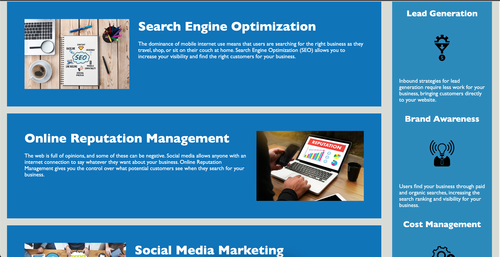

# horiseon

Horiosen Code Refactor for accesibility

## Description

I decided to work on this project because I want to help the company implement accessibility on their website.
In this project, I improved the accessibility without changes to the look of the website.
I made the website more accessible by using semantic elements. I consolidated the CSS classes and commented the CSS file.

I definitely learned the importance of accessibility and how to work on different platforms (Visual Studio Code, the terminal, GitHub), and about making consistent changes and checking if everything aligns with the main code.

## Usage

  
To open the webpage open index.html in your webbrowser. It should look like this:

## Credits

I used [W3Schools](https://www.w3schools.com/) as a reference for HTML and CSS.

I used [codingbootcamp](https://coding-boot-camp.github.io/full-stack/github/professional-readme-guide) as a guide to write this README.